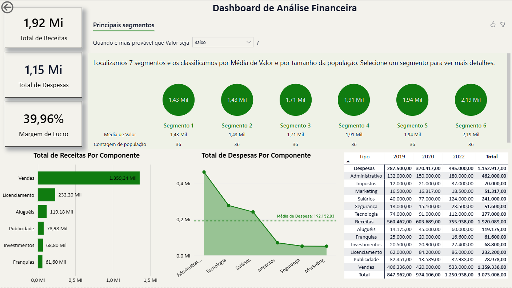
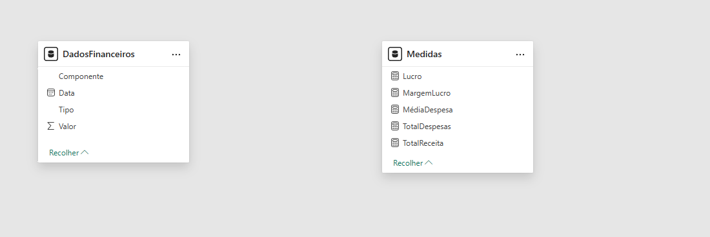
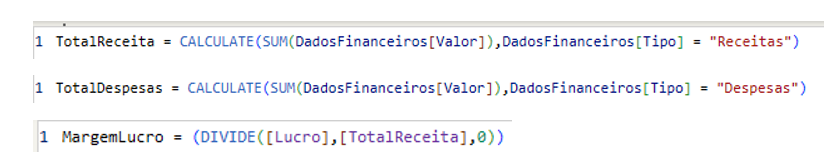

# Dashboard de Análise Financeira
# Dashboard desenvolvido no Power BI para análise de receitas, despesas e margem de lucro utilizando Power Query, DAX e indicadores financeiros.

## Sobre o Projeto:

Este projeto foi desenvolvido no **Power BI** com o objetivo de criar um dashboard interativo para análise financeira, permitindo acompanhar indicadores de receitas, despesas e margem de lucro.

Para a construção da solução foram utilizadas medidas DAX, indicadores (KPIs) e recursos de visualização do Power BI, proporcionando uma visão consolidada do desempenho financeiro e auxiliando na interpretação dos dados para apoio à tomada de decisão.

##  Dashboard

Abaixo está a visão geral do dashboard desenvolvido no Power BI.

##  Tecnologias Utilizadas

- **Power BI** - Desenvolvimento do dashboard e criação das visualizações.
- **Power Query** - Validação, tratamento e preparação dos dados antes da modelagem.
- **DAX (Data Analysis Expressions)** - Desenvolvimento de medidas para cálculo dos indicadores financeiros.
- **Modelagem de Dados** - Organização da estrutura de dados e das medidas para suportar as análises.

## Organização do Modelo

Para manter o projeto organizado, foi criada uma tabela dedicada às medidas DAX, separando os cálculos da tabela principal de dados. Essa abordagem facilita a manutenção do modelo e melhora a organização do desenvolvimento no Power BI.

- 
 ##  Competências Demonstradas

- Desenvolvimento de dashboards interativos no Power BI.
- Tratamento e preparação de dados utilizando Power Query.
- Criação de medidas DAX para indicadores financeiros.
- Construção de KPIs para análise de receitas, despesas e margem de lucro.
- Organização e modelagem dos dados para suporte às análises.
- Desenvolvimento de visualizações para apoio à tomada de decisão.

  ##  Principais Medidas DAX

Para o desenvolvimento dos indicadores financeiros, foram criadas medidas utilizando DAX para realizar os principais cálculos do dashboard.

| Medida | Finalidade |
|--------|------------|
| **TotalReceita** | Calcula o valor total das receitas. |
| **TotalDespesas** | Calcula o valor total das despesas. |
| **MargemLucro** | Calcula a margem de lucro com base nas receitas e no lucro obtido. |

##  Principais Insights

Com este dashboard é possível:

- Acompanhar a evolução das receitas ao longo do período analisado.
- Comparar receitas e despesas para avaliar a margem de lucro.
- Identificar os componentes com maior participação nas receitas.
- Identificar os principais componentes responsáveis pelas despesas.
- Monitorar indicadores financeiros por meio de KPIs.
- Apoiar a tomada de decisão utilizando informações consolidadas.

## Implementação das Medidas DAX

##  Estrutura dos Dados

Os dados utilizados neste projeto foram organizados em uma tabela financeira contendo informações de:

- Tipo da movimentação (Receita ou Despesa)
- Componente financeiro
- Data da movimentação
- Valor financeiro

Durante o processo de desenvolvimento, os dados passaram por validação e tratamento no **Power Query**, garantindo consistência antes da criação das medidas DAX e das visualizações no Power BI.

##  Aprendizados

Durante o desenvolvimento deste projeto, foi possível aplicar conceitos fundamentais de Business Intelligence utilizando o Power BI.

Os principais aprendizados foram:

- Desenvolvimento de dashboards interativos para análise financeira.
- Tratamento e preparação de dados utilizando Power Query.
- Criação de medidas DAX para construção de indicadores financeiros.
- Organização da modelagem dos dados para facilitar as análises.
- Construção de KPIs para acompanhamento de receitas, despesas e margem de lucro.
- Desenvolvimento de visualizações para transformar dados em informações úteis para apoio à tomada de decisão.

Este projeto contribuiu para consolidar conhecimentos em Power BI e fortalecer habilidades voltadas para a área de Análise de Dados.
